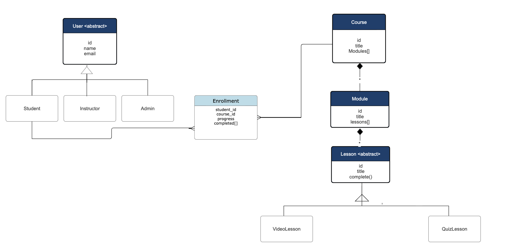

# LearnFlow LMS Backend

## Overview

This project implements a simplified Learning Management System (LMS) backend using Python.

## UML Diagram




## Design Decisions

### 1. Use of Abstract Base Classes

* `User` is defined as an abstract class with role-based subclasses:

  * `Student`
  * `Instructor`
  * `Admin`

* `Lesson` is also abstract and extended by:

  * `VideoLesson`
  * `QuizLesson`

This ensures that new lesson types can be added without modifying existing logic.


### 2. Composition over Inheritance

The course structure follows a composition hierarchy:

* A `Course` contains multiple `Module`s
* A `Module` contains multiple `Lesson`s

This models real-world relationships and keeps the design flexible.


### 3. Enrollment as a Separate Entity

Instead of directly linking students and courses, an `Enrollment` class is introduced.

This allows us to:

* Track progress per student per course
* Store completed lessons
* Avoid bloating `Student` or `Course` classes


### 4. Progress Tracking

Each `Enrollment` maintains a set of completed lesson IDs:

* A `set` is used to avoid duplicate entries
* Progress is calculated as:

  completed_lessons / total_lessons * 100

This logic is kept inside the `Enrollment` class since it operates only on its own data.


### 5. Repository Layer

In-memory repositories are used:

* `CourseRepo`
* `EnrollmentRepo`

These abstract data access and make it easy to switch to a real database (e.g., SQLite) later without changing business logic.


### 6. Service Layer

The `LearningService` handles:

* Enrollment logic
* Lesson completion
* Progress retrieval
* Validation (e.g., checking if a lesson belongs to a course)

This keeps models simple and ensures business logic is centralized.


## Extensibility

New lesson types can be added easily:

```python
class LiveWebinarLesson(Lesson):
    def complete(self):
        return "Webinar attended"
```


## Edge Cases Handled

* Prevent duplicate enrollment
* Prevent marking lessons not part of a course
* Handle empty courses in progress calculation
* Avoid duplicate lesson completion using a set


```bash
python -m unittest discover tests
```
